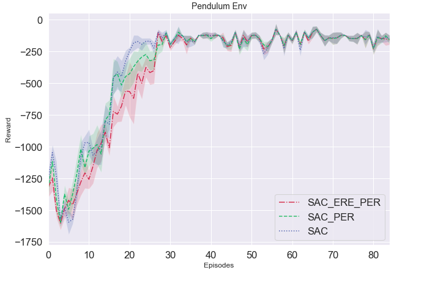

# Paper-plotting
Plotting of captured Tensorboard runs for seeded RL comparison

This repository provides a notebook with which it is possible to create nicely looking comparison plots of seeded training runs for Reinforcement Learning Algorithms. All you need is to:
- download the results of your training runs *(All runs must have the same length!)*
- store them for each Algorithm in their own directory
- change the path to that directory in the notebook code and maybe add or delete data preparation depending on how many algorithms you want to compare

Final output should look something like this:

Feel free to use, add something or improve the code. 

